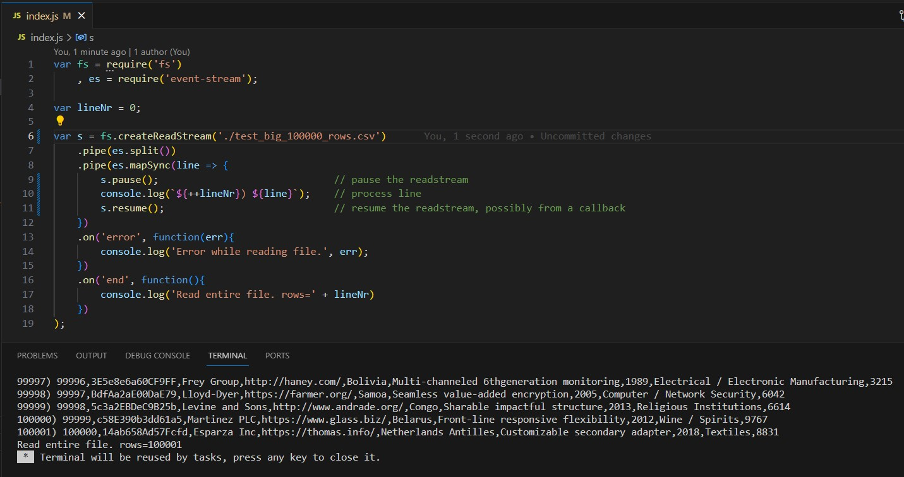
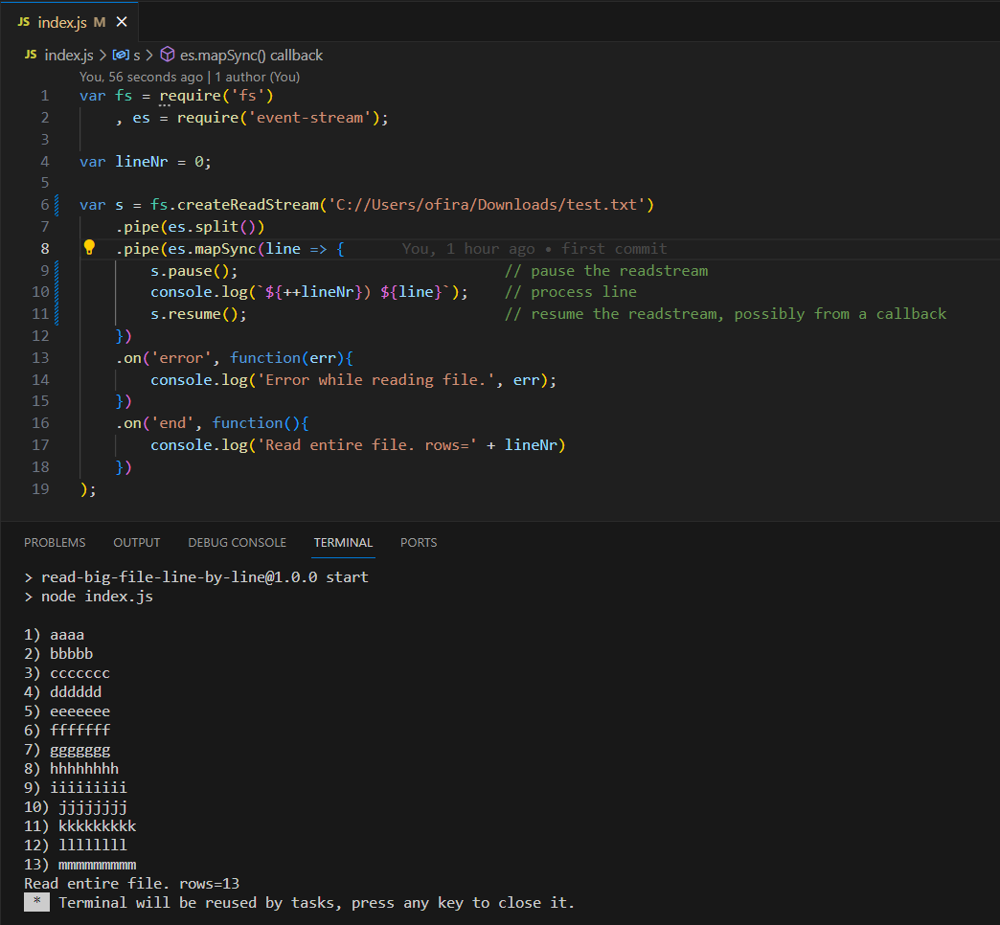
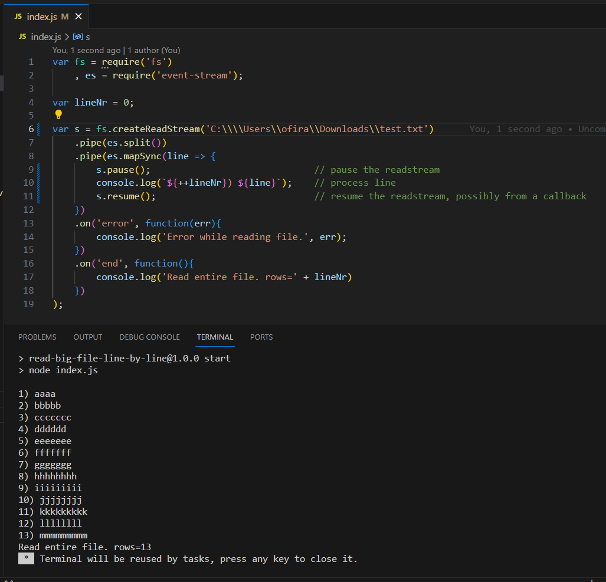

Test reading and handling big txt file line by line by js  

Big csv file:  
downloaded the test 100K lines csv file from here:  
https://www.datablist.com/learn/csv/download-sample-csv-files  

code from here:  
https://stackoverflow.com/questions/16010915/parsing-huge-logfiles-in-node-js-read-in-line-by-line/23695940#23695940  

